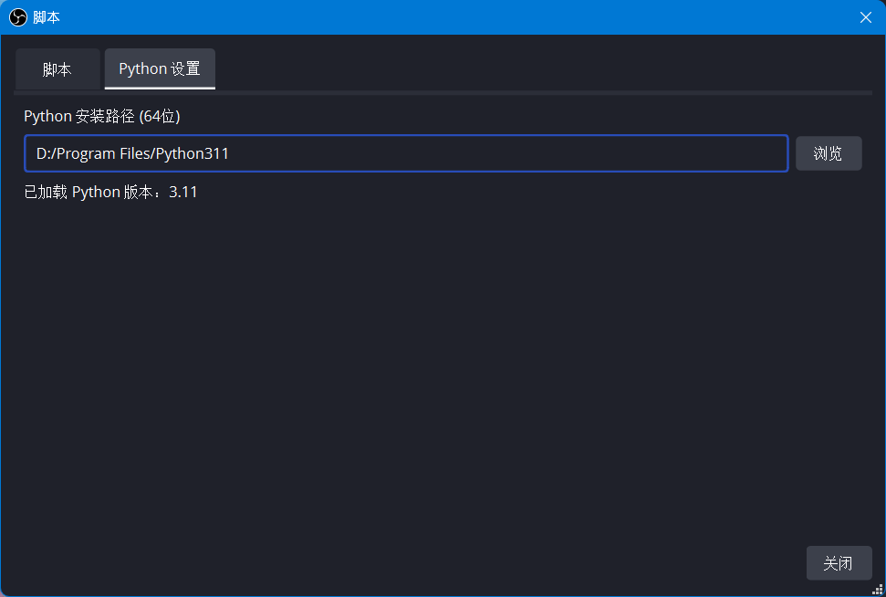
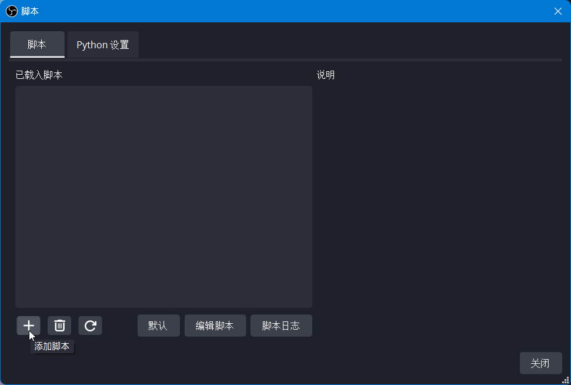
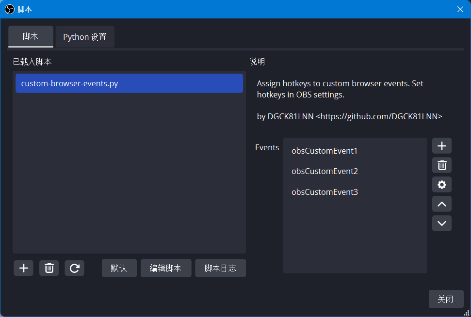
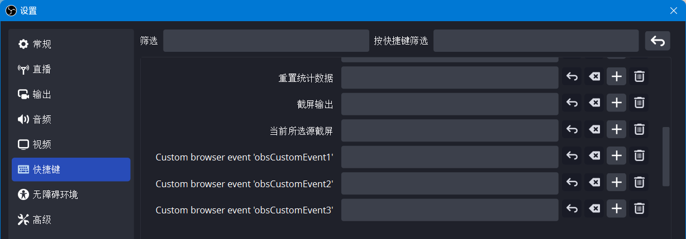

# OBS 浏览器源自定义 JS 事件

这是一个针对 OBS 的 Python 脚本，可以让你用快捷键在当前场景组中所有的浏览器源上触发自定义的 JavaScript 事件。

## 用法

 1. 启动 OBS Studio。在“**工具 > 脚本**”中, 选择“**Python 设置**”一栏。选中 Python 的安装位置。请确保 Python 已经安装好，且体系结构与 OBS 相同（如 64 位的 OBS 就要装 64 位的 Python，不能装 32 位的 Python）。

    

 2. 仍然在“脚本”窗口中，回到“**脚本**”一栏，点击左下角的加号按钮。选中 `custom-browser-events.py` 文件。

    

 3. 脚本加载好后，右边会出现“**Events**”框，可以用来管理您的自定义事件。

    

 4. 设置好事件名称后，您可以关闭“**脚本**”窗口，前往“**文件 > 设置 > 快捷键**”设置快捷键。自定义事件会出现在第一个小标题上面。

    

 5. 要侦听自定义事件，只需在浏览器源的页面的 JavaScript 代码中添加：

    ~~~js
    window.addEventListener("obsCustomEvent1", function (ev) {
      document.body.append("Hello, world!")
    })
    ~~~

    或者使用函数定义：

    ~~~js
    function doSomething(ev) {
      // ...
    }
    window.addEventListener("obsCustomEvent1", doSomething)
    ~~~

    您也可以省略“`window.`”。
