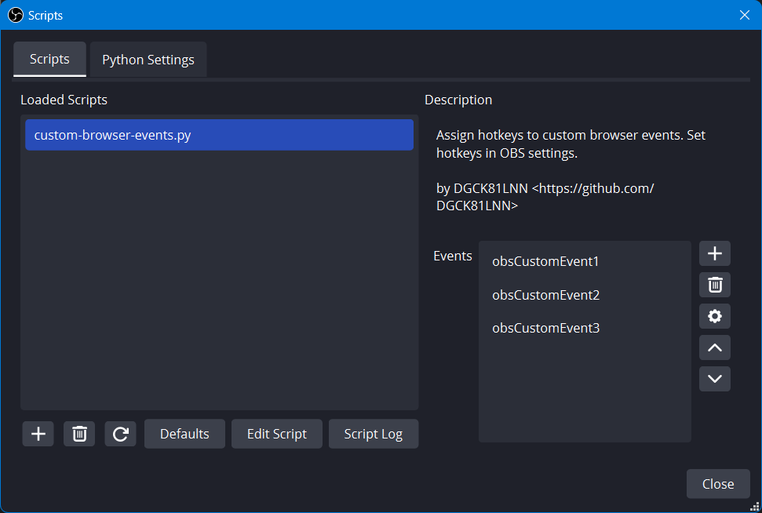

# Custom JavaScript events for OBS Studio browser sources   OBS 浏览器源自定义 JS 事件

[简体中文 · Read in Simplified Chinese](README-zh.md)

This Python script for OBS Studio allows you to trigger custom JavaScript events on all browser sources (in the current scene collection) using hotkeys.

## Usage

 1. Launch OBS Studio. Under **Tools > Scripts**, open the **Python Settings** tab. Choose the installation folder of Python. Make sure you have Python installed and it has the same architecture as OBS studio (e.g. for 64-bit OBS Studio install 64-bit Python, not 32-bit Python).

    

 2. In the same window, navigate back to the **Scripts** tab and click on the plus button in the bottom left. Choose the `custom-browser-events.py` file.

    

 3. After the script is loaded, you should see the **Events** box to the right. Here you can manage your custom events.

    

 4. Once you are happy with the event names, you can close the **Scripts** window and go to **Files > Settings > Hotkeys** to set your hotkeys. The custom events will appear at the bottom of the topmost section, above the sections for specific scenes.

    

 5. To listen for custom events, simply add something like this in the JavaScript code for your browser page:

    ~~~js
    window.addEventListener("obsCustomEvent1", function (ev) {
      document.body.append("Hello, world!")
    })
    ~~~

    Or with a function declaration:

    ~~~js
    function doSomething(ev) {
      // ...
    }
    window.addEventListener("obsCustomEvent1", doSomething)
    ~~~

    Omit “`window.`” if you like.
